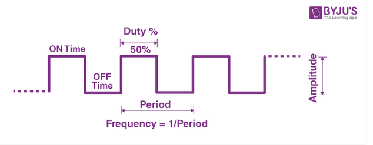
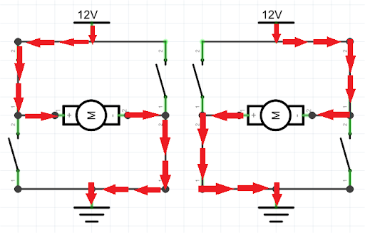

# ELECTRONICS

## Từ khóa: 
Lập trình Arduino, Platform IO, mạch cầu H, PWM, PCB,...

## PWM
[PWM là gì?](https://youtu.be/GQLED3gmONg)

## Mạch cầu H
[Mạch cầu H là gì?](https://youtu.be/3N_4VpzmKY0)

# Mở rộng
## [YouTube - Branch Education](https://www.youtube.com/c/BranchEducation)

1. [How does Computer Hardware Work?](https://www.youtube.com/watch?v=d86ws7mQYIg)
2. [How does Computer Memory Work?](https://www.youtube.com/watch?v=7J7X7aZvMXQ)
3. [How do Hard Disk Drives Work?](https://www.youtube.com/watch?v=wtdnatmVdIg)

## [YouTube - Tri thức nhân loại](https://www.youtube.com/c/TriTh%E1%BB%A9cNh%C3%A2nLo%E1%BA%A1i)
1. [Transistor hoạt động như thế nào? | Transistor là gì? | Bóng bán dẫn là gì? | Tri thức nhân loại](https://www.youtube.com/watch?v=5M6wclkmJ28)

> [!NOTE]
>
> Trên đây chỉ là tổng hợp các nguồn tài liệu mà các bạn có thể tham khảo và tập luyện tại đó, SGT không yêu cầu và không đề xuất các bạn học tất cả các tài liệu trên. 
> 
> Hãy tự chọn lọc và học ở nền tảng phù hợp với bạn. 